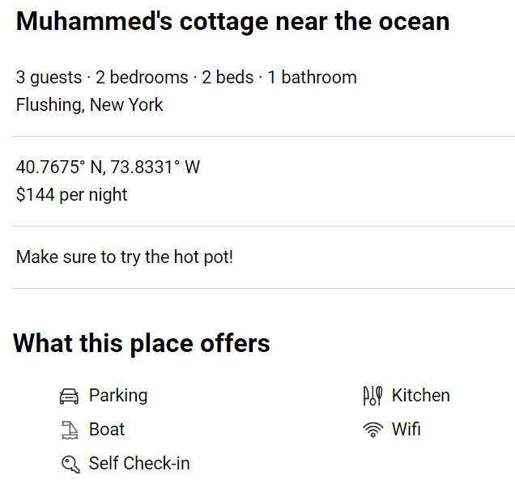
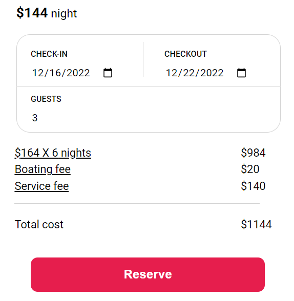
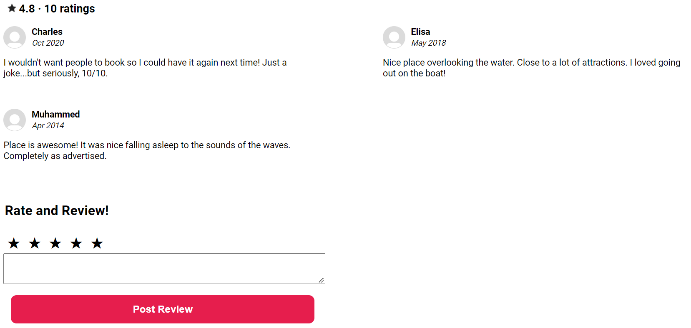
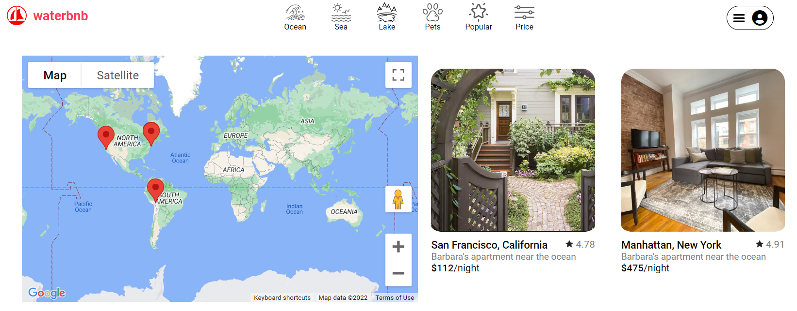

# Fullstack Project: WaterBnb

WaterBnb is a water-themed travel booking site -- a clone of AirBnb.  Like AirBnb, WaterBnb allows users to views different listings around the world, make reservations, and leave ratings and reviews.  It uses the Google Maps API to give exact locations and let users search by location.  The splash page is an index of all the listings, with a map centered in New York City by default.

<!-- ## Wireframe:

 -->

## With WaterBnb, users can:

- #### See Listings, with detailed information and photos

Each listing has a show page showing multiple photos, location, ameninities, and other important information.

- #### Reserve listings (CRUD feature), with costs calculated dynamically

Users (who are logged in) can reserve listings and watch as costs change based on their length of stay and number of guests.  This is a full CRUD feature -- users can also read, modify, or cancel reservations for upcoming trips.

- #### Search specific locations and see nearby attractions using Google Maps

Users can use Google Maps to search specific locations, with each property having a popup summarizing key information.  Every page uses Google maps, either for or to show the exact location of a specific listing.

- #### See ratings and reviews; rate/review a property

Users can read reviews of each listing, see ratings, and leave their own ratings/reviews.  This is *not* a full CRUD feature -- like AirBnb, WaterBnb doesn't allow users to delete or modify reviews, because it could create a conflict of interest.  Average rating is stored with each listing and dynamically recalculated whenever a user rates a property.  (For purposes of being a better demo, logged-in users can rate/review any property, but they can't rate/review the same property more than once in a day.)

- #### Filter listings by categories and max price

Rather than looking at all properties at once, users can filter by the body of water it's near (ocean, sea, or lake), by maximum price, or to show only places that allow pets or are highly rated (at least 5 ratings with average of at least 4.5 stars -- that's what the user is looking at currently).  Because filters show fewer listings, the default map for with filters is a full world map.

### This project also includes:
- Extensive seed data
- Photos stored on AWS
- A production README

## Technologies and libraries used:
- AWS
- Google Maps
- React
- Ruby on Rails

## Implementation Timeline:
- Friday-Monday: User Authorization
- Tuesday-Friday: Listings
- Saturday-Monday: Reservations
- Tuesday: Google Maps
- Wednesday: Ratings/Reviews
- Thursday: Filters

## Future Features:
- Search
- CRUD functionality for listings
- More categories (and more seed data to show them)
- Carousel for photos

## Sources:
- Photos, descriptions, and amenity icons taken from AirBnb
- Filter Icons taken from [here](https://www.flaticon.com/)